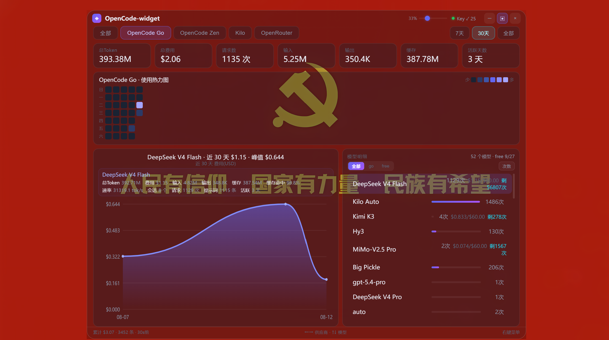
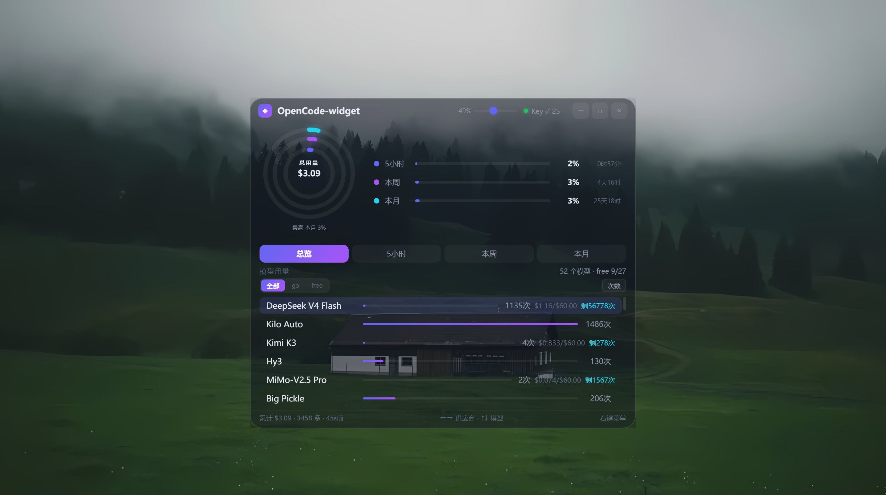

# OpenCode-widget

OpenCode / Codex / Go 用量悬浮窗 —— 透明玻璃面板，实时显示 OpenCode Go 配额、模型用量与费用。





## 特性

- **透明悬浮窗**：Electron 原生透明窗口，背景透出桌面，文字与 SVG 内容保持清晰（CSS 逐像素 alpha，拖动滑块调节）
- **三档尺寸**：最小屏（吸顶 Dock 模式）/ 中屏 / 大屏仪表盘
- **吸顶自动变小屏**：窗口拖到屏幕顶部自动吸附并切换为最小屏（Mac Dock 风格），拖离自动恢复
- **实时用量**：滚动（5h）/ 每周 / 每月 Go 配额百分比 + 剩余时间
- **模型明细**：按 go/free 分组、供应商筛选、模型用量排行、历史曲线（真实时间轴）
- **大屏仪表盘**：GitHub 风格热力图、统计卡片、供应商切换（全部/Go/Kilo/Zen/Router）
- **官方数据同步**：通过浏览器登录 opencode.ai 后同步官方配额数值
- **快捷键**：←→ 切换供应商 · ↑↓ 切换模型

## 架构

```
┌─────────────────────┐      HTTP/JSON       ┌──────────────────────────────┐
│  data_server.py     │ ───────────────────► │  Electron 透明窗口            │
│  · 读本地数据        │  127.0.0.1:8765      │  · 渲染进程直连数据服务        │
│  · 计算用量/统计      │                      │  · 窗口交互/吸顶/透明度         │
│  · 启动预热+缓存      │                      └──────────────────────────────┘
│  · 官方数据同步      │
└─────────────────────┘
```

- **Python 只负责取数与计算**（`data_server.py` + `go-usage-widget.py` 数据函数 + `server_data.py` 官方同步）
- **前端与窗口交互交给 Electron**（`electron/main.js` / `preload.js` / `app/index.html`）
- 启动预热：数据服务启动即后台计算，首请求毫秒级返回；模型列表 24h 缓存

## 快速开始

```bat
启动Go用量悬浮窗.cmd
```

或手动：

```bat
start "" "%LOCALAPPDATA%\Programs\Python\Python311\pythonw.exe" data_server.py
start "" electron\node_modules\electron\dist\electron.exe electron
```

依赖：Python 3.11 + pywebview（仅登录辅助）、Node.js + Electron（`electron/` 内 `npm install`）。

## 数据来源

- 本地 `~/.local/share/opencode/opencode.db`（OpenCode 会话用量）+ `~/.codex/logs_2.sqlite`
- 官方 opencode.ai Go 配额（配置 auth cookie 后经 `POST /api/sync` 同步）

## 右键菜单

立即刷新 / 用浏览器登录（打开 opencode.ai 获取 Cookie）/ 自动抓取 Cookie 同步数值 / 服务器配置（手动）/ 手动校准 / API Key 设置

## 目录结构

```
data_server.py          # 数据服务（预热/缓存/API）
go-usage-widget.py      # 数据计算函数（用量/统计/历史/热力图）
server_data.py          # 官方用量抓取与落库
electron/
  main.js               # 透明窗口/吸顶/尺寸
  preload.js            # 最小 IPC 桥
  app/index.html        # 前端界面
```
